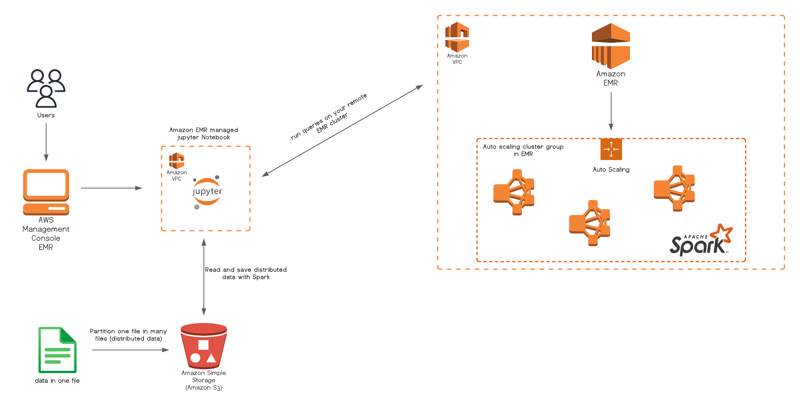

<h1 style="color:#FF9900">Development of a recommendation system in AWS, for a Big Data environment</h1>

<h1 style="color:#FF9900">Introduction:</h1>

Currently, the large amount of information that many companies receive today generates the need to find solutions that allow them to process all this information and make recommendations that allow end users to have a better experience. Recommendation systems solve the problem of infoxication or information overload. These systems perform various information processing and cleaning techniques to create a recommendation model that allows to recommend, predict tastes or products to users.

Inside the recommendation systems we find different approaches, however, the one that obtains the best results and is the most popular is the collaborative filtering. The objective of this work is to create a recommendation system based on collaborative filtering, adapted to a Big Data environment and using a cloud provider such as AWS. This objective arises from the current need of companies to have a robust infrastructure to process large amounts of information for their recommender systems.

<h1 style="color:#FF9900">Problem:</h1>

The exponential growth of information means that today's recommender systems have to process millions of pieces of data. To perform this processing, high performance computing is needed to process the data and send it to the recommender system to provide results. The problem arises from the need to have a high computational power to process all this information. Currently, many recommender systems work with an infrastructure based on a non-distributed process.

<h2 style="color:#00C553" >Big Data enviroment</h2>

The problem with these non-distributed recommender systems is that they do not make full use of all the resources of the equipment they have. In addition to this, being a non-distributed system, the information processing and recommendation time is quite high because everything is processed through a single task. This problem generates both time and money costs for companies that need to process millions of data.

One solution is to use a Big Data environment, in this case **Apache Spark**. In this case Apache Spark is a Big Data environment that allows processing a large amount of information in a distributed way, taking advantage of all the resources of the server.

<h2 style="color:#00C553" >Cloud computing vs On promise Solutions</h2>

Apache Spark needs several considerable computational resources such as memory, cpu, disk ... etc. One solution could be to buy a **local server (on promise)** that has the required features to run Apache Spark, taking into account the needs you have. However, this solution requires additional costs such as maintenance, support, security ... among others, which generates that **this proposal is not so accepted**.

<h1 style="color:#FF9900">Solution:</h1>

<h2 style="color:#00C553">Infraestructure:</h2>

  

<h2 style="color:#00C553">Steps:</h2>

  
  * #### Step 1: Data Gathering
  
  
  * #### Step 2: Data Wrangling
  
  
  
  * #### Step 3: Train Model
  
  
  
  * #### Step 4: Evaluate Model
  

<h1 style="color:#FF9900">Results:</h1>
